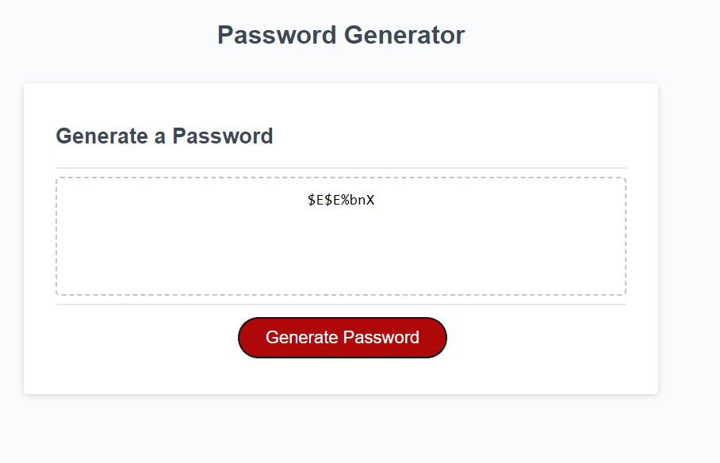

# Password Generator Starter Code

## The purpose of this repo is to practice with javascript using functions and different variables, the objective was to create a password generator where user can choose different value types and it displays the end product on the screen.

## USER STORY

### AS AN employee with access to sensitive data </b> I WANT to randomly generate a password that meets certain criteria</b>SO THAT I can create a strong password that provides greater security

## ACCEPTANCE CRITERIA

### GIVEN I need a new, secure password</b>WHEN I click the button to generate a password</b>THEN I am presented with a series of prompts for password criteria</b>WHEN prompted for password criteria</b>THEN I select which criteria to include in the password</b>WHEN prompted for the length of the password</b>THEN I choose a length of at least 8 characters and no more than 128 characters</b>WHEN asked for character types to include in the password</b>THEN I confirm whether or not to include lowercase, uppercase, numeric, and/or special characters</b>WHEN I answer each prompt</b>THEN my input should be validated and at least one character type should be selected</b>WHEN all prompts are answered</b>THEN a password is generated that matches the selected criteria</b>WHEN the password is generated</b>THEN the password is either displayed in an alert or written to the page</b>

### An image of the end result - displaying a generated password.

## Click [here](https://dolivafig.github.io/random_password/) to go to the website.
